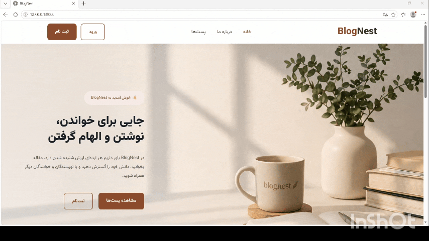

# BlogNest

A full-featured Django blogging platform with a server-rendered web application and a versioned REST API.

BlogNest was built to explore modern Django development patterns, REST API design, authentication, API versioning, permissions, testing, containerization, and deployment workflows.

---

## Demo



---

## Overview

**BlogNest** is a blogging platform built with Django and Django REST Framework.

The project provides two main interfaces:

- A server-rendered web application built with Django templates
- A versioned REST API built with Django REST Framework

Users can register, verify their email, authenticate, manage their profile, create and manage blog posts, categorize posts, and interact through comments.

The REST API is divided into multiple versions to demonstrate different API implementation approaches, including Function-Based Views and ModelViewSets.

---

## Features

### Web Application

- User registration and authentication
- Email account activation
- Login and logout
- User profile management
- Password change and password reset
- Create, edit, and delete blog posts
- Draft and published post states
- Post categories
- Post images
- Publication date scheduling
- Comments
- Comment deletion with ownership permissions
- Category-based post filtering
- Responsive server-rendered interface
- Custom styled authentication and application pages

### REST API

- RESTful blog API
- API versioning
- Token Authentication
- JWT Authentication
- JWT token refresh
- User registration through API
- Email verification
- Password management
- Profile retrieval and update
- Blog post CRUD operations
- Category management
- Comment listing and creation
- Comment deletion
- Pagination
- Category filtering
- Dynamic API representations
- Ownership-based permissions
- Swagger / ReDoc API documentation

---

## Tech Stack

### Backend

- Python
- Django
- Django REST Framework
- Django REST Framework Simple JWT
- Django Filter
- PostgreSQL
- JWT
- Token Authentication

### Frontend

- Django Templates
- HTML5
- CSS3
- JavaScript
- Font Awesome
- Vazirmatn

### Development & DevOps

- Docker
- Docker Compose
- Nginx
- Git
- GitHub Actions
- Pytest
- Locust

---

# REST API

The REST API is one of the main components of BlogNest.

The project uses API versioning to demonstrate different approaches to implementing REST endpoints.

## API Structure

```text
API
├── Accounts
│   └── v1
│
├── Blog
│   ├── v1
│   └── v2
│
└── Comment
    └── v1
```

---

## Accounts API v1

The Accounts API provides authentication, account verification, profile management, and password management.

### Authentication

The project supports both:

- Token Authentication
- JWT Authentication

### Main Endpoints

| Method | Endpoint | Description |
|---|---|---|
| POST | `/registration` | Register a new user |
| POST | `/token/login/` | Obtain authentication token |
| POST | `/token/logout/` | Delete authentication token |
| PUT | `/change-password/` | Change authenticated user's password |
| GET / PUT | `/profile/` | Retrieve or update user profile |
| POST | `/jwt/create/` | Obtain JWT access and refresh tokens |
| POST | `/jwt/refresh/` | Refresh JWT access token |
| GET | `/activation/<token>` | Activate user account |
| POST | `/activation/resend/` | Resend activation email |
| POST | `/reset-password/email/` | Request password reset |
| PUT | `/reset-password/<token>` | Set a new password |

### Account Features

- Password validation using Django's password validators
- Password confirmation validation
- Email verification
- JWT-based activation tokens
- Token-based authentication
- JWT authentication
- Password change
- Password reset through email
- Authenticated profile management

---

# Blog API v1

Blog API v1 uses **Function-Based Views** to provide a simple implementation of CRUD operations.

### Endpoints

| Method | Endpoint | Description |
|---|---|---|
| GET | `/post/` | List posts |
| POST | `/post/` | Create a post |
| GET | `/post/<id>/` | Retrieve a post |
| PUT | `/post/<id>/` | Update a post |
| DELETE | `/post/<id>/` | Delete a post |

### Implementation

- Django REST Framework Function-Based Views
- Authentication with `IsAuthenticated`
- Ownership-based permissions
- ModelSerializer
- CRUD operations for blog posts

### Post Fields

```text
id
title
content
status
author
published_date
```

---

# Blog API v2

Blog API v2 provides a more advanced implementation using **DRF ModelViewSet** and **DefaultRouter**.

### Features

- Full CRUD with `ModelViewSet`
- Public read access
- Authenticated write operations
- Ownership-based permissions
- Pagination
- Category filtering
- Category API
- Nested category representation
- Dynamic response representation
- Absolute URLs
- Automatic author assignment

### Post Endpoints

The API uses DRF's `DefaultRouter` to generate the CRUD routes for posts.

### Category Endpoints

Categories are also exposed through a dedicated `ModelViewSet`.

### Dynamic Responses

The Post serializer adapts its response depending on the request context.

For list responses:

```text
content
```

is omitted and an `absolute_url` is provided.

For detail responses:

```text
absolute_url
```

is omitted and the full post content is returned.

Categories are represented as nested objects in the API response.

### Author Assignment

When creating a post, the authenticated user is automatically assigned as the author rather than relying on the client to provide the author.

---

# API Versioning

One of the goals of BlogNest is demonstrating different approaches to REST API implementation.

| Feature | Blog API v1 | Blog API v2 |
|---|---|---|
| Views | Function-Based Views | ModelViewSet |
| Routing | Django `path()` | DRF `DefaultRouter` |
| Authentication | Required | Public read / authenticated write |
| Pagination | No | Yes |
| Filtering | No | Category filtering |
| Categories | No | Yes |
| Dynamic representation | No | Yes |
| Absolute URLs | No | Yes |

This structure allows the project to demonstrate how the same domain can evolve from a simple function-based implementation into a more feature-rich ViewSet-based API.

---

# Comment API v1

The Comment API provides endpoints for retrieving, creating, and deleting comments.

### Endpoints

| Method | Endpoint | Description |
|---|---|---|
| GET | `/post/<post_id>/comments/` | List comments for a post |
| POST | `/post/<post_id>/comments/` | Create a comment |
| DELETE | `/delete/<id>/` | Delete a comment |

### Features

- Public comment listing
- Authenticated comment creation
- Automatic user assignment
- Automatic post assignment
- Pagination
- Ownership-based deletion
- Absolute URL generation

The API prevents clients from manually assigning the author or target post during comment creation. These values are derived from the authenticated request and URL.

---

# Authentication & Permissions

BlogNest uses multiple authentication mechanisms depending on the API functionality.

### Token Authentication

Used for token-based login and logout.

### JWT Authentication

JWT is used for:

- User authentication
- Access tokens
- Refresh tokens
- Email activation
- Password reset workflows

### Permissions

The project uses Django REST Framework permissions such as:

```text
IsAuthenticated
IsAuthenticatedOrReadOnly
```

alongside custom ownership permissions to control access to resources.

---

# API Documentation

The project includes API documentation through:

- Swagger
- ReDoc

These tools provide an interactive overview of the available REST API endpoints and their request/response schemas.

---

# Project Structure

A simplified project structure:

```text
BlogNest/
│
├── core/
│   ├── accounts/
│   │   └── api/
│   │       └── v1/
│   │
│   ├── blog/
│   │   └── api/
│   │       ├── v1/
│   │       └── v2/
│   │
│   ├── comment/
│   │   └── api/
│   │       └── v1/
│   │
│   ├── templates/
│   ├── static/
│   └── ...
│
├── Dockerfile
├── docker-compose...
├── nginx/
├── requirements...
└── .github/
    └── workflows/
```

The application is separated into independent Django apps for accounts, blogging, and comments, while API versions are kept inside their respective applications.

---

# Docker

BlogNest is containerized using Docker and Docker Compose.

The project includes separate configuration files for different environments and uses containerized services for the application infrastructure.

The production-oriented architecture includes components such as:

```text
Client
   │
   ▼
 Nginx
   │
   ▼
Django
   │
   ├── PostgreSQL
   ├── Redis
   └── Celery
```

This structure makes the project suitable for development as well as deployment-oriented experimentation.

---

# Testing

Testing is included as part of the project development workflow.

The project uses:

- Pytest for automated testing
- Postman for API testing
- Locust for load testing

These tools were used to test API behavior and evaluate the application under different request loads.

---

# CI/CD

GitHub Actions is included in the project for automated development workflows.

The repository contains workflow configurations for testing and deployment-related processes.

The deployment workflow is kept as part of the project architecture for future server deployment.

---

# Running the Project

## Clone the repository

```bash
git clone https://github.com/SAEED-ESK/BlogNest.git
cd BlogNest
```

## Environment Variables

Create the required environment configuration according to the project's Django and database settings.

Typical configuration includes values for:

```text
SECRET_KEY
DEBUG
DATABASE_URL
```

Additional environment variables may be required depending on the selected Docker environment and email configuration.

## Run with Docker Compose

Use the appropriate Docker Compose configuration included in the repository.

For example:

```bash
docker compose up --build
```

Then apply migrations:

```bash
docker compose exec web python manage.py migrate
```

Create a superuser if needed:

```bash
docker compose exec web python manage.py createsuperuser
```

---

# Development

BlogNest was developed with a focus on learning and applying practical backend development concepts, including:

- Django application architecture
- Class-Based Views
- Function-Based Views
- Django REST Framework
- REST API design
- API versioning
- Authentication and authorization
- Custom permissions
- Serializer validation
- JWT authentication
- Email-based workflows
- PostgreSQL
- Docker
- Redis
- Celery
- Automated testing
- API testing
- Load testing
- CI/CD

---

# Future Improvements

Possible future improvements include:

- More comprehensive automated test coverage
- Improved API documentation
- Additional API versions
- Advanced search functionality
- Richer frontend interactions
- Production deployment
- Improved caching strategies
- More granular permissions
- Additional monitoring and observability

---

# Project Goals

The main goal of BlogNest was not simply to build a blogging website.

The project was designed as a practical backend portfolio project covering the complete lifecycle of a Django application:

```text
Django
   ↓
Database
   ↓
Server-rendered Web Application
   ↓
REST API
   ↓
Authentication & Permissions
   ↓
Testing
   ↓
Docker
   ↓
CI/CD
   ↓
Deployment
```

This makes BlogNest a practical demonstration of Django backend development, REST API engineering, and containerized application workflows.

---

## License

This project is available for educational and portfolio purposes.
